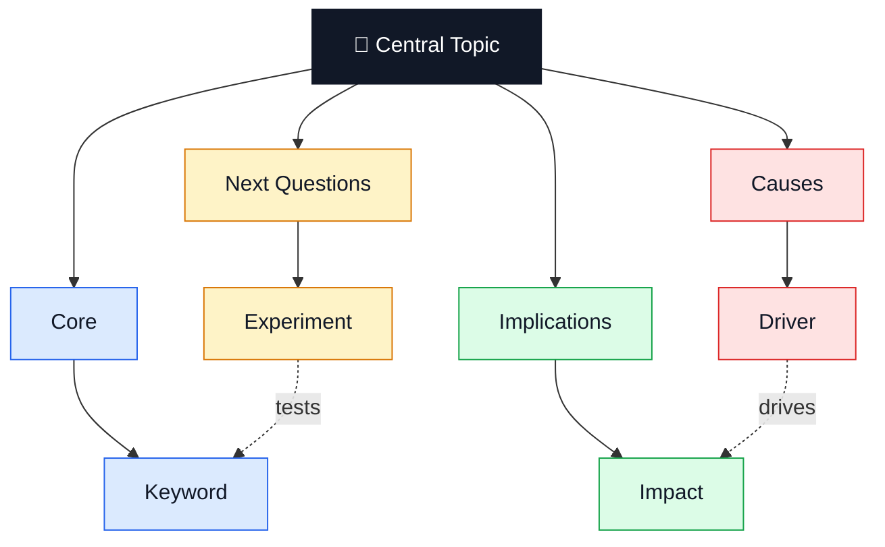
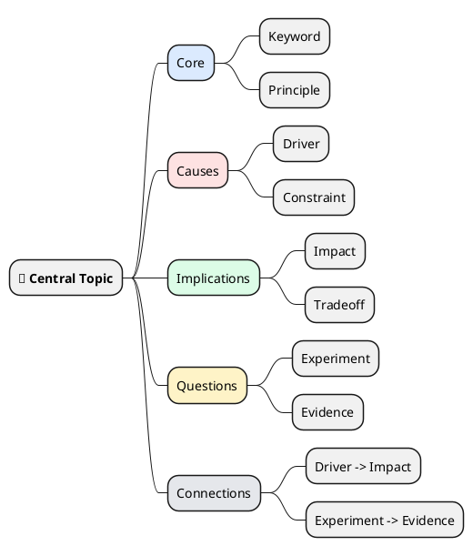

# brainstorm-mindmap

Generate a mind map that helps the user develop their thinking: "开发我的大脑，更加深刻地进行头脑风暴，进行剖析，认识和理解问题和文章".

Prefer a useful thinking artifact over a decorative diagram. The map should expose structure, tensions, hidden assumptions, connections, and next questions.

## Trigger Conditions

Use this skill when the user asks to:

- brainstorm, dissect, analyze, understand, remember, or explore an idea through a mind map
- convert an article URL, article text, notes, or a vague topic into a Mermaid or PlantUML mind map
- render a generated mind map into PNG/SVG
- develop deeper thinking, "开发我的大脑", or improve comprehension of a problem/article

## Contract

- **scope_in**: raw ideas, vague topics, problem statements, pasted notes, article text, article URLs, Markdown, and requests for Mermaid or PlantUML mind maps with optional PNG/SVG rendering.
- **scope_out**: generic image generation without diagram source, long-form article rewriting, claims that require unverified current facts, and diagrams unrelated to brainstorming or understanding.
- **Preconditions**: a topic, idea, article URL, pasted article, or local note is available; network access or browsing is available when the input is a URL.
- **Postconditions**: output includes Mermaid or PlantUML source; if rendering is requested, an image path is returned or a concrete rendering blocker is reported; the map uses compact keywords, 3-5 main branches, visual cues, and cross-branch connections where the format supports them.

## Input Handling

### Idea or problem

1. Restate the central topic in 3-8 words.
2. Identify what the user is trying to understand, decide, create, or challenge.
3. If the idea is vague, infer a useful angle and proceed; ask only when the missing detail changes the whole map.

### Article URL

1. Fetch or browse the article before summarizing it.
2. Extract the title, thesis, key claims, evidence, assumptions, implications, and unresolved questions.
3. Cite the URL in the final response when facts or article interpretation are used.
4. If the URL is inaccessible, ask for pasted text or proceed only with clearly labeled limited context.

### Article text or notes

1. Preserve the author's core argument.
2. Compress paragraphs into keywords and short phrases.
3. Separate article claims from your own inferred questions or critiques.

## Mind Map Quality Checklist

Apply this checklist before emitting source:

1. **Center**: place the main topic at the center/root; make it visually distinct with a larger label, emoji/icon, thicker style, or highlighted color.
2. **Branches**: use 3-5 main branches. Good default branches are `Core`, `Why`, `How`, `Risks`, and `Next`.
3. **Simple hierarchy**: keep most paths to 2-3 levels. Avoid turning the map into an outline dump.
4. **Keywords**: use one word or a short phrase per node. Avoid full sentences unless clarity would suffer.
5. **Color coding**: give each main branch a distinct color and reuse it for child nodes when the syntax supports styling.
6. **Visual cues**: use restrained emojis/icons for memory hooks, not decoration.
7. **Connections**: add cross-links between related nodes on different branches to reveal patterns, tensions, feedback loops, causes, and dependencies.
8. **Directionality**: use arrows for cause/effect, sequence, contradiction, or reinforcement.
9. **Emphasis**: highlight the few concepts that matter most for later recall.

This checklist is adapted from common mind-mapping practice and the New Trader U "Perfect Mind Map" six-step framing: grouped, reflective, interconnected, non-verbal, directional, and emphasized.

## Diagram Format Choice

- **Default to Mermaid flowchart** when the user wants cross-links, colors, arrows, or a rendered image that preserves analytical relationships. Use a hub-and-spoke layout to behave like a mind map.
- **Use Mermaid mindmap** when the user explicitly wants compact mindmap syntax and cross-links are not essential.
- **Use PlantUML mindmap** when the user asks for PlantUML or wants a classic radial/tree mind map. If cross-links are important, represent them as a dedicated `Connections` branch or switch to Mermaid flowchart with a short explanation.

## Execution

### Phase 1: Understand

- Entry: user provides an idea, article, URL, or note.
- Steps:
  1. Read/fetch the source.
  2. Extract central topic and objective.
  3. Identify 3-5 major groups.
  4. List the most important cross-branch relationships.
- Exit: central topic, main branches, child nodes, and cross-links are known.
- On fail: ask for source text or clarify the central topic.

### Phase 2: Deepen

- Entry: Phase 1 complete.
- Steps:
  1. Add "why" and "so what" nodes where the map is shallow.
  2. Add assumptions, contradictions, leverage points, and open questions.
  3. Prune low-value details until the map is readable.
- Exit: the map helps analysis, comprehension, memory, and brainstorming.
- On fail: return a first-pass map and mark weak areas as `?`.

### Phase 3: Generate source

- Entry: Phase 2 complete.
- Steps:
  1. Choose Mermaid or PlantUML using the format rules.
  2. Emit valid fenced source code.
  3. Include colors/styles for main branches when supported.
  4. Add cross-links after tree edges when using Mermaid flowchart.
- Exit: diagram source is syntactically plausible and ready to render.
- On fail: simplify syntax and preserve semantic structure.

### Phase 4: Render image when requested

- Entry: source generated and user wants PNG/SVG/rendered image.
- Steps:
  1. Save source to a predictable file such as `output/<slug>.mmd` or `output/<slug>.puml` unless the user provides a path.
  2. Prefer the existing renderer at `../diagram-render/scripts/render_diagram.py`.
  3. Run:
     ```bash
     python ../diagram-render/scripts/render_diagram.py mermaid -i output/topic.mmd -o output/topic.png
     python ../diagram-render/scripts/render_diagram.py plantuml -i output/topic.puml -o output/topic.png
     ```
  4. Verify the output image exists and is non-empty.
- Exit: return the source path and image path.
- On fail: return the source path, renderer error, and the missing dependency or remediation.

## Mermaid Flowchart Pattern

Use this when cross-links and styling matter:



## PlantUML Mindmap Pattern

Use this for classic PlantUML mindmap output:



## Verification

### Hard gates

- Main branches count is 3-5 unless the user explicitly asks otherwise.
- Node labels are mostly keywords or short phrases.
- Source is valid Mermaid or PlantUML fenced code.
- Rendered image exists and is non-empty when rendering is requested.

### Soft gates

- The map surfaces at least one hidden assumption, contradiction, or open question.
- Cross-links show cause/effect, dependency, contrast, or feedback instead of arbitrary association.
- Colors and icons improve grouping and recall without visual clutter.
- For article maps, the output distinguishes source claims from inferred analysis.

## Response Shape

For source-only requests:

1. Give a one-line summary of the map's organizing logic.
2. Provide the Mermaid or PlantUML source.
3. Mention any important assumptions or unresolved questions.

For rendered-image requests:

1. Give the source file path and image file path.
2. Briefly state the renderer used.
3. Include the source only if the user asked for it or it is short enough to be useful.

For article URLs:

1. Include the source URL in the final response.
2. Avoid long quotations; paraphrase the article's structure and ideas.
