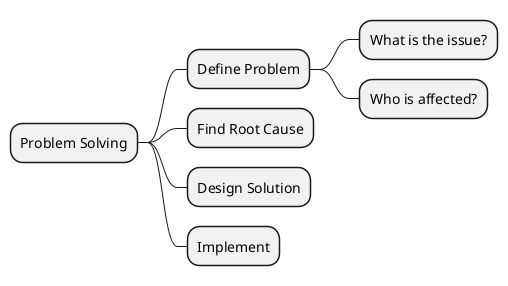
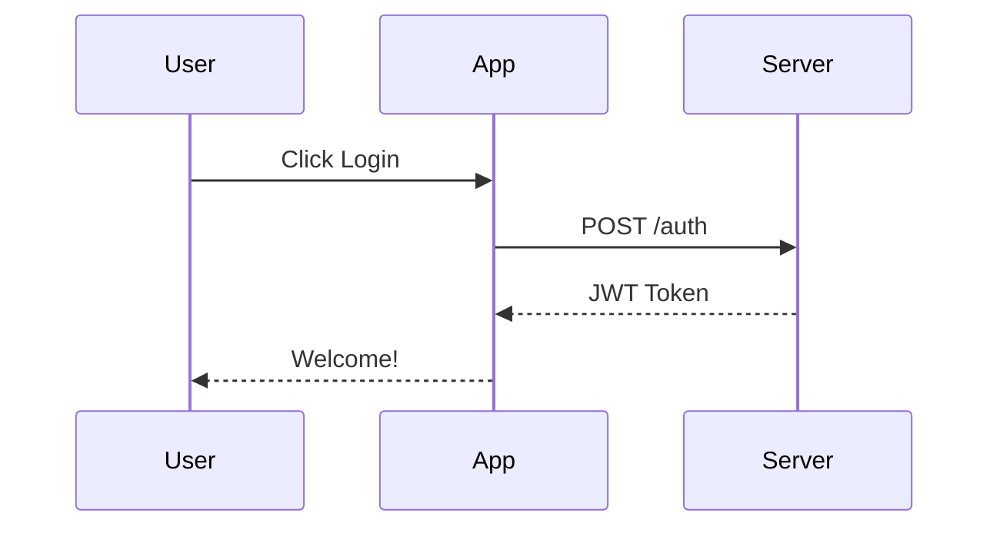
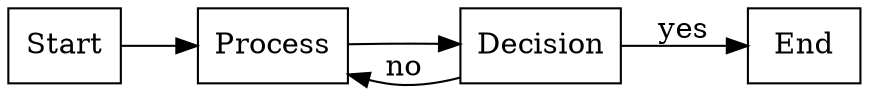

# diagram-render

Render diagram code blocks (PlantUML, Mermaid, Graphviz) to PNG/SVG images.

All `scripts/` paths below are relative to the skill directory.

## Prerequisites

- **Python 3.9+**
- **requests** — `pip install requests` (for PlantUML server rendering)

Optional (for local rendering):
- **graphviz** — `brew install graphviz` or `pip install graphviz`
- **mermaid-cli** — `npm install -g @mermaid-js/mermaid-cli`

Install dependencies:

```bash
# Recommended: uv handles deps automatically
uv run scripts/render_diagram.py --help

# Or via pip
pip install -r scripts/requirements.txt
```

## Trigger Scenarios

- User asks to render a PlantUML, Mermaid, or Graphviz diagram
- User wants to convert a `.puml`, `.mmd`, or `.dot` file to an image
- A markdown file contains diagram code blocks that need rendering
- User asks to generate architecture, sequence, flow, or ER diagrams

## Contract

- **scope_in**: PlantUML, Mermaid, and Graphviz diagram sources; `.puml`, `.mmd`, `.dot`, and markdown files with supported diagram code blocks; requests to render PNG or SVG output.
- **scope_out**: Hand-drawn diagrams, unsupported diagram syntaxes, heavy diagram design/editing beyond rendering, and arbitrary image editing.
- **Preconditions**: The user provides diagram source text or an input file; the required runtime or renderer is available for the chosen backend.
- **Postconditions**: The requested diagram is rendered or a concrete blocker is reported; the output format and destination are explicit; any fallback used is stated.

## Execution

### Phase 1: Identify input
- Entry: Diagram source, file path, or markdown file is available.
- Steps:
  1. Detect the diagram type and desired output format.
  2. Confirm whether the request targets a single source file, stdin, or markdown extraction.
- Exit: Renderer, input source, and output target are known.
- On fail: Stop and ask for the missing diagram source, file path, or type instead of guessing.

### Phase 2: Render
- Entry: Phase 1 completed.
- Steps:
  1. Run `scripts/render_diagram.py` with the correct type, input, and output arguments.
  2. Use the local renderer when available; otherwise use the supported fallback path documented by the script and references.
- Exit: A render attempt completes with an output file or explicit error.
- On fail: Report the exact missing dependency or renderer error and fall back to another supported backend only if it preserves the requested diagram semantics.

## Verification

### Hard gates
- Output file exists at the requested path.
- Output format matches the requested `png` or `svg`.
- The selected renderer matches the detected diagram type.

### Soft gates
- Output is readable and non-empty.
- The response includes the command or script invocation used.
- Any fallback, limitation, or unsupported syntax is called out explicitly.

## Feedback

- **Failure modes**: Missing renderer dependency, unsupported syntax, malformed diagram source, or markdown extraction that finds no supported code blocks.
- **Boundary examples**: Reject unsupported diagram engines or generic image-generation requests; redirect image editing to a more appropriate skill.
- **Improvement triggers**: Update this skill when `scripts/render_diagram.py` adds new diagram engines, new output formats, or different dependency requirements.

## Quick Start

1. Write diagram source to a file (or pass via stdin)
2. Run the render script:
   ```bash
   python scripts/render_diagram.py <type> -i <input_file> -o <output_file>
   ```
3. Verify the output image exists

**Supported types:** `plantuml`, `mermaid`, `graphviz` (or `dot`)

**Output formats:** `png` (default), `svg` (via `-f svg`)

## Examples

### PlantUML mind map

**Input:** `mindmap.puml`


**Command:**
```bash
python scripts/render_diagram.py plantuml -i mindmap.puml -o output/mindmap.png
```

### Mermaid sequence diagram

**Input:** `auth.mmd`


**Command:**
```bash
python scripts/render_diagram.py mermaid -i auth.mmd -o output/auth_sequence.png
```

### Graphviz directed graph

**Input:** `flow.dot`


**Command:**
```bash
python scripts/render_diagram.py graphviz -i flow.dot -o output/flow.png
```

### Render from stdin

```bash
echo '@startuml
Alice -> Bob: Hello
Bob --> Alice: Hi!
@enduml' | python scripts/render_diagram.py plantuml -o output.png
```

### Base64 output

```bash
python scripts/render_diagram.py plantuml -i diagram.puml --base64 > diagram_b64.txt
```

## Additional Resources

- For CLI argument details, batch processing, error handling, and tips, see [references/detailed-guide.md](references/detailed-guide.md)
