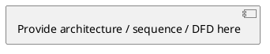

# [Feature Name] — Technical Design Spec

| Field | Value |
|-------|-------|
| **Author** | [Name] |
| **Reviewers** | [Names] |
| **Status** | DRAFT |
| **Jira** | [JIRA-ID](https://your-org.atlassian.net/browse/JIRA-ID) |
| **Created** | [YYYY-MM-DD] |
| **Last Updated** | [YYYY-MM-DD] |
| **Template Version** | Simplified from Official v2.2.2 |

---

## 1. Introduction

### 1.1 Purpose

[Overall description of the feature/change and why it is needed.]

### 1.2 Scope

[What this document covers and does not cover.]

### 1.3 Background

[Business and technical context. Who is producing this document and why.]

### 1.4 References

| # | Reference | Link |
|---|-----------|------|
| 1 | [Document name] | [URL] |

### 1.5 Assumptions and Constraints

**Assumptions**

- [Assumption 1 — e.g., availability of a platform, policy decision]

**Constraints**

- [Constraint 1 — e.g., legal requirement, technical standard, strategic decision]

---

## 2. Overall Architecture

[High-level architectural and design changes. Include a Data Flow Diagram or sequence diagram. Mark trust boundaries if any.]



---

## 3. Functional Requirements

### 3.1 User Requirements

[Requirements by user class. Give each requirement a unique ID (U-01, U-02, ...).]

| ID | User Class | Requirement | Priority |
|----|-----------|-------------|----------|
| U-01 | [Role] | [Requirement] | P0/P1/P2 |

### 3.2 Platform Scope

[Check which platforms are affected.]

| Platform | Affected? | Notes |
|----------|-----------|-------|
| Windows | Yes/No | |
| Mac | Yes/No | |
| iOS | Yes/No | |
| Android | Yes/No | |
| Linux | Yes/No | |
| Web | Yes/No | |
| Desktop client | Yes/No | |

### 3.3 API / Interface Requirements

[Describe APIs and user interfaces to be implemented.]

| Method | Path | Description |
|--------|------|-------------|
| POST | /v2/... | [Description] |

**Request / Response Example:**

```json
// Request
{ "field": "value" }

// Response 200
{ "id": "uuid", "status": "ok" }

// Error 4xx
{ "code": 1234, "message": "..." }
```

### 3.4 Third-Party Dependencies

Does this feature use or integrate any third-party hardware, firmware, software (including OSS), or services?

| Component | Type | License | Purpose |
|-----------|------|---------|---------|
| [Name] | OSS / Commercial / HW | [License] | [Purpose] |

### 3.5 Reliability & Performance

**Reliability Impact**

[Document reliability impact. SLA targets, failover, redundancy.]

**Performance Impact**

[Expected impact on latency, throughput, resource consumption.]

### 3.6 Dependency and Compatibility

[List dependencies on other services, client versions, SDK versions.]

| Dependency | Version | Notes |
|------------|---------|-------|
| [Service/SDK] | [Version] | [Notes] |

### 3.7 Operational Impact

Is there any impact on the deployment or operation of the cloud platform?

- [ ] Additional compute capacity
- [ ] Deployment script changes
- [ ] New infrastructure (DB, cache, queue)
- [ ] Configuration changes (OP switches)

[If yes, describe specifics.]

---

## 4. Security

> Engage the Security Owner (SO) assigned to the Jira ticket. If none, email security@example.com.

### 4.1 Assets

[List all assets stored/transferred/processed.]

| Asset | Classification | Storage | Description |
|-------|---------------|---------|-------------|
| [Asset] | L2/L3/L4/L5 | [Where] | [Description] |

### 4.2 Security Controls

[Describe applicable controls.]

| Control | Applicable? | Details |
|---------|------------|---------|
| Authentication | Yes/No | [Details] |
| Authorization | Yes/No | [Details] |
| Encryption at rest | Yes/No | [Details] |
| Encryption in transit | Yes/No | [Details] |
| Auditing & Logging | Yes/No | [Details] |
| Input validation | Yes/No | [Details] |

### 4.3 Threat Model (STRIDE)

| ID | Threat Type | Description | Mitigation | Status |
|----|-------------|-------------|------------|--------|
| TM-01 | Spoofing | [Threat] | [Mitigation] | Mitigated / Partial / Not mitigated |
| TM-02 | Tampering | [Threat] | [Mitigation] | |
| TM-03 | Repudiation | [Threat] | [Mitigation] | |
| TM-04 | Info Disclosure | [Threat] | [Mitigation] | |
| TM-05 | Denial of Service | [Threat] | [Mitigation] | |
| TM-06 | Elevation of Privilege | [Threat] | [Mitigation] | |

---

## 5. Data Governance & Privacy

> Skip this section if the feature does not process Customer Personal Data.

### 5.1 Personal Data Processed

| Data Category | Classification | Collected From | Purpose |
|---------------|---------------|----------------|---------|
| [Category] | L2/L3/L4/L5 | [Data subject] | [Purpose] |

### 5.2 Data Lifecycle

| Question | Answer | Notes |
|----------|--------|-------|
| Integrated with DSAR? | Yes/No | |
| Integrated with DSDR? | Yes/No | |
| Retention defined? | Yes/No | [Method] |
| Cross-cluster / regional? | Yes/No | |

---

## 6. Accessibility

> Skip if this is a pure backend change with no UI.

- [ ] Text/background contrast ratio >= 4.5:1
- [ ] Color not used alone to convey information
- [ ] Meaningful page/dialog titles
- [ ] Descriptive labels and headings
- [ ] Keyboard accessible controls
- [ ] No keyboard traps
- [ ] Screen reader compatible

---

## 7. Observability

### 7.1 Feature Toggles

[List OP switches, account/user-level toggles to enable/disable the feature.]

### 7.2 Logging & Tracing

[What events are logged, data classification of logs, transport/storage, tools used.]

### 7.3 Telemetry & Metrics

| Metric | Type | Labels | Description |
|--------|------|--------|-------------|
| [metric_name] | Counter/Histogram/Gauge | [labels] | [Description] |

---

## 8. AI/ML (if applicable)

> Skip if the feature does not use AI/ML.

| Question | Answer |
|----------|--------|
| AI/ML used? | Yes/No |
| Generative AI? | Yes/No |
| Skill type | Summarization / Composition / Classification / Q&A / Other |
| Model provider & name | [e.g., Meta Llama 2] |
| Self-hosted / managed / third-party? | [Choice] |
| Federated AI approach? | Yes/No |
| Model inputs | [List] |
| Model outputs | [List] |
| Output stored? | Cloud / Device / Not stored |
| Human review opportunity? | Modify / Reject / N/A |

---

## 9. Review & Sign-Off

| Reviewer | Role | Date | Status |
|----------|------|------|--------|
| [Name] | Dev Lead | | Pending |
| [Name] | Security Owner | | Pending |
| [Name] | PM | | Pending |

---

## Appendix A — Glossary

| Term | Definition |
|------|-----------|
| [Term] | [Definition] |
