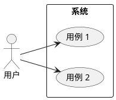
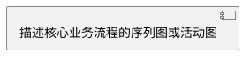
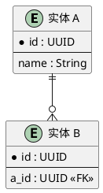

# [服务名称] 微服务设计文档

| 字段 | 值 |
|------|------|
| **作者** | [姓名] |
| **评审人** | [姓名] |
| **状态** | 草案 |
| **创建日期** | [YYYY-MM-DD] |
| **最后更新** | [YYYY-MM-DD] |

---

## 1. 总体介绍

### 1.1 需求

#### 1.1.1 业务需求和目标

**需求分析**

[描述业务背景和驱动因素]

**用户场景**

| 场景 | 参与者 | 描述 | 优先级 |
|------|--------|------|--------|
| [场景名] | [角色] | [简述] | P0/P1/P2 |

**用例图**



#### 1.1.2 技术需求

| 需求类别 | 指标 | 目标值 |
|----------|------|--------|
| 容量 | QPS | [TBD] |
| 容量 | 数据量 | [TBD] |
| 高可用 | 可用性 | 99.9% / 99.99% |
| 高可用 | RTO / RPO | [TBD] |
| 安全性 | 认证方式 | [TBD] |
| 安全性 | 数据加密 | [TBD] |
| 伸缩性 | 水平扩展 | [TBD] |

### 1.2 背景

#### 1.2.1 业务背景

[当前业务流程与痛点]

#### 1.2.2 技术背景

**当前架构**

[现有系统架构描述及图示]

**容量现状**

[当前系统容量数据]

**局限和性能瓶颈**

[已知的技术限制和瓶颈]

---

## 2. 设计

### 2.1 总体架构

**架构图**

```
┌──────────┐    ┌──────────┐    ┌──────────┐
│  客户端   │───►│  API 网关 │───►│  服务 A   │
└──────────┘    └──────────┘    └────┬─────┘
                                     │
                               ┌─────▼─────┐
                               │   数据库   │
                               └───────────┘
```

**关键设计决策**

| 决策 | 选择 | 理由 |
|------|------|------|
| [决策 1] | [选项] | [原因] |

### 2.2 备选方案

| 维度 | 方案 A | 方案 B |
|------|--------|--------|
| 描述 | [简述] | [简述] |
| 优点 | [列举] | [列举] |
| 缺点 | [列举] | [列举] |
| 成本 | [估算] | [估算] |
| 风险 | [评估] | [评估] |

**结论**: [选择哪个方案及理由]

### 2.3 领域设计

**主要领域对象**

| 对象 | 描述 | 核心属性 |
|------|------|----------|
| [实体名] | [描述] | [属性列表] |

**核心流程**



**实体关系图**



### 2.4 范围与影响

**变更范围**

| 组件 | 变更类型 | 描述 |
|------|----------|------|
| [组件名] | 新增 / 修改 / 废弃 | [简述] |

**上下游影响**

| 上游/下游 | 服务 | 影响 | 应对 |
|-----------|------|------|------|
| 上游 | [服务名] | [影响描述] | [应对措施] |
| 下游 | [服务名] | [影响描述] | [应对措施] |

### 2.5 详细设计

#### 2.5.1 接口描述

**API 列表**

| 方法 | 路径 | 描述 |
|------|------|------|
| GET | /api/v1/resource | 查询资源 |
| POST | /api/v1/resource | 创建资源 |

**接口详情**

```
POST /api/v1/resource
Content-Type: application/json

Request:
{
  "name": "string",
  "type": "string"
}

Response 200:
{
  "id": "uuid",
  "name": "string",
  "created_at": "datetime"
}

Error 400:
{
  "error": "string",
  "message": "string"
}
```

#### 2.5.2 逻辑描述

[核心业务逻辑的描述，含流程图]

#### 2.5.3 数据结构

**数据库表结构**

```sql
CREATE TABLE resource (
    id          UUID PRIMARY KEY,
    name        VARCHAR(255) NOT NULL,
    type        VARCHAR(50)  NOT NULL,
    created_at  TIMESTAMP    NOT NULL DEFAULT NOW(),
    updated_at  TIMESTAMP    NOT NULL DEFAULT NOW()
);

CREATE INDEX idx_resource_type ON resource(type);
```

#### 2.5.4 局限与限制

[已知的系统局限]

#### 2.5.5 性能问题

[潜在的性能瓶颈及优化策略]

#### 2.5.6 设计约束

[架构约束、技术约束、组织约束]

#### 2.5.7 意外情况处理

| 场景 | 影响 | 处理方式 |
|------|------|----------|
| [异常场景] | [影响范围] | [处理/降级策略] |

---

## 3. 依赖条件

### 3.1 平台

| 平台 | 版本 | 用途 |
|------|------|------|
| [如 K8s] | [版本] | [用途] |

### 3.2 数据库

| 数据库 | 版本 | 用途 |
|--------|------|------|
| [如 PostgreSQL] | [版本] | [用途] |

### 3.3 其他服务及其 SDK

| 服务/SDK | 版本 | 用途 |
|----------|------|------|
| [服务名] | [版本] | [用途] |

---

## 4. 部署

### 4.1 配置

| 配置项 | 默认值 | 说明 |
|--------|--------|------|
| [配置名] | [默认值] | [说明] |

### 4.2 安装

[安装步骤]

### 4.3 部署及验证

**部署步骤**

1. [步骤 1]
2. [步骤 2]

**验证清单**

- [ ] 健康检查端点正常
- [ ] 核心 API 返回正确
- [ ] 日志无异常
- [ ] 指标上报正常

---

## 5. 度量

### 5.1 关键因素 KPI

| KPI | 定义 | 目标 |
|-----|------|------|
| [KPI 名] | [定义] | [目标值] |

### 5.2 度量设计

| 指标名 | 类型 | 标签 | 说明 |
|--------|------|------|------|
| `request_total` | Counter | method, path, status | 请求总数 |
| `request_duration_seconds` | Histogram | method, path | 请求延迟 |

### 5.3 度量工具

| 工具 | 用途 |
|------|------|
| Prometheus | 指标采集 |
| Grafana | 仪表盘 |
| PagerDuty | 告警 |

---

## 6. 测试方案

### 6.1 测试用例

| 用例 | 前置条件 | 步骤 | 预期结果 |
|------|----------|------|----------|
| [用例名] | [条件] | [步骤] | [结果] |

### 6.2 API 测试方案

[API 自动化测试策略及工具]

### 6.3 集成测试和端到端测试方案

[集成/E2E 测试策略及环境]

### 6.4 性能测试方案

| 场景 | 工具 | 目标 |
|------|------|------|
| [场景名] | [工具] | [性能目标] |

---

## 7. 问题与风险

| # | 类型 | 描述 | 可能性 | 影响 | 缓解措施 |
|---|------|------|--------|------|----------|
| 1 | 风险 | [描述] | 高/中/低 | 高/中/低 | [措施] |
| 2 | 问题 | [描述] | — | — | [措施] |

---

## 8. 参考文档和链接

- [文档名](URL)
