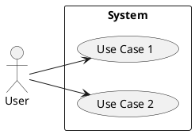
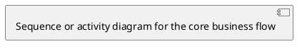
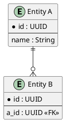

# [Service Name] Microservice Design Document

| Field | Value |
|-------|-------|
| **Author** | [Name] |
| **Reviewers** | [Names] |
| **Status** | DRAFT |
| **Created** | [YYYY-MM-DD] |
| **Last Updated** | [YYYY-MM-DD] |

---

## 1. Introduction

### 1.1 Requirements

#### 1.1.1 Business Requirements and Goals

**Requirements Analysis**

[Describe business background and driving factors]

**User Scenarios**

| Scenario | Actor | Description | Priority |
|----------|-------|-------------|----------|
| [Scenario name] | [Role] | [Brief description] | P0/P1/P2 |

**Use Case Diagram**



#### 1.1.2 Technical Requirements

| Category | Metric | Target |
|----------|--------|--------|
| Capacity | QPS | [TBD] |
| Capacity | Data volume | [TBD] |
| Availability | Uptime | 99.9% / 99.99% |
| Availability | RTO / RPO | [TBD] |
| Security | Authentication | [TBD] |
| Security | Data encryption | [TBD] |
| Scalability | Horizontal scaling | [TBD] |

### 1.2 Background

#### 1.2.1 Business Background

[Current business process and pain points]

#### 1.2.2 Technical Background

**Current Architecture**

[Existing system architecture description and diagram]

**Current Capacity**

[Current system capacity data]

**Limitations and Performance Bottlenecks**

[Known technical limitations and bottlenecks]

---

## 2. Design

### 2.1 Overall Architecture

**Architecture Diagram**

```
┌──────────┐    ┌──────────┐    ┌──────────┐
│  Client   │───►│ API GW   │───►│ Service A │
└──────────┘    └──────────┘    └────┬─────┘
                                     │
                               ┌─────▼─────┐
                               │  Database  │
                               └───────────┘
```

**Key Design Decisions**

| Decision | Choice | Rationale |
|----------|--------|-----------|
| [Decision 1] | [Option] | [Reason] |

### 2.2 Alternatives

| Dimension | Option A | Option B |
|-----------|----------|----------|
| Description | [Brief] | [Brief] |
| Pros | [List] | [List] |
| Cons | [List] | [List] |
| Cost | [Estimate] | [Estimate] |
| Risk | [Assessment] | [Assessment] |

**Conclusion**: [Which option and why]

### 2.3 Domain Design

**Key Domain Objects**

| Object | Description | Core Attributes |
|--------|-------------|-----------------|
| [Entity name] | [Description] | [Attribute list] |

**Core Workflow**



**Entity Relationship Diagram**



### 2.4 Scope and Impact

**Change Scope**

| Component | Change Type | Description |
|-----------|-------------|-------------|
| [Component] | New / Modified / Deprecated | [Brief] |

**Upstream/Downstream Impact**

| Direction | Service | Impact | Mitigation |
|-----------|---------|--------|------------|
| Upstream | [Service] | [Impact] | [Mitigation] |
| Downstream | [Service] | [Impact] | [Mitigation] |

### 2.5 Detailed Design

#### 2.5.1 API Description

**API List**

| Method | Path | Description |
|--------|------|-------------|
| GET | /api/v1/resource | Query resource |
| POST | /api/v1/resource | Create resource |

**API Details**

```
POST /api/v1/resource
Content-Type: application/json

Request:
{
  "name": "string",
  "type": "string"
}

Response 200:
{
  "id": "uuid",
  "name": "string",
  "created_at": "datetime"
}

Error 400:
{
  "error": "string",
  "message": "string"
}
```

#### 2.5.2 Logic Description

[Core business logic with flowcharts]

#### 2.5.3 Data Structures

**Database Schema**

```sql
CREATE TABLE resource (
    id          UUID PRIMARY KEY,
    name        VARCHAR(255) NOT NULL,
    type        VARCHAR(50)  NOT NULL,
    created_at  TIMESTAMP    NOT NULL DEFAULT NOW(),
    updated_at  TIMESTAMP    NOT NULL DEFAULT NOW()
);

CREATE INDEX idx_resource_type ON resource(type);
```

#### 2.5.4 Limitations and Constraints

[Known system limitations]

#### 2.5.5 Performance Considerations

[Potential bottlenecks and optimization strategies]

#### 2.5.6 Design Constraints

[Architectural, technical, and organizational constraints]

#### 2.5.7 Exception Handling

| Scenario | Impact | Handling |
|----------|--------|----------|
| [Exception] | [Blast radius] | [Handling / degradation strategy] |

---

## 3. Dependencies

### 3.1 Platform

| Platform | Version | Purpose |
|----------|---------|---------|
| [e.g. K8s] | [Version] | [Purpose] |

### 3.2 Database

| Database | Version | Purpose |
|----------|---------|---------|
| [e.g. PostgreSQL] | [Version] | [Purpose] |

### 3.3 Other Services and SDKs

| Service/SDK | Version | Purpose |
|-------------|---------|---------|
| [Service] | [Version] | [Purpose] |

---

## 4. Deployment

### 4.1 Configuration

| Config Key | Default | Description |
|------------|---------|-------------|
| [Key] | [Default] | [Description] |

### 4.2 Installation

[Installation steps]

### 4.3 Deployment and Verification

**Deployment Steps**

1. [Step 1]
2. [Step 2]

**Verification Checklist**

- [ ] Health check endpoint returns OK
- [ ] Core APIs respond correctly
- [ ] No errors in logs
- [ ] Metrics reporting active

---

## 5. Metrics

### 5.1 Key Performance Indicators

| KPI | Definition | Target |
|-----|-----------|--------|
| [KPI name] | [Definition] | [Target value] |

### 5.2 Metric Design

| Metric Name | Type | Labels | Description |
|-------------|------|--------|-------------|
| `request_total` | Counter | method, path, status | Total requests |
| `request_duration_seconds` | Histogram | method, path | Request latency |

### 5.3 Metric Tools

| Tool | Purpose |
|------|---------|
| Prometheus | Metric collection |
| Grafana | Dashboards |
| PagerDuty | Alerting |

---

## 6. Testing Strategy

### 6.1 Test Cases

| Case | Precondition | Steps | Expected Result |
|------|-------------|-------|-----------------|
| [Case name] | [Condition] | [Steps] | [Result] |

### 6.2 API Testing

[API automation testing strategy and tools]

### 6.3 Integration and E2E Testing

[Integration/E2E strategy and environments]

### 6.4 Performance Testing

| Scenario | Tool | Target |
|----------|------|--------|
| [Scenario] | [Tool] | [Performance target] |

---

## 7. Issues and Risks

| # | Type | Description | Likelihood | Impact | Mitigation |
|---|------|-------------|------------|--------|------------|
| 1 | Risk | [Description] | High/Med/Low | High/Med/Low | [Mitigation] |
| 2 | Issue | [Description] | — | — | [Action] |

---

## 8. References

- [Document name](URL)
