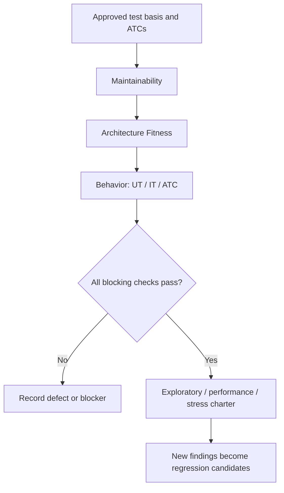

# Harness and Release Verdict Model

ATCs are the Behavior Harness contract, not the entire quality system. Reliable
AI-assisted delivery combines feedforward guidance, evidence-producing feedback,
three verification layers, and explicit safety boundaries.

## Feedforward and feedback

| Direction | Purpose | Examples |
| --- | --- | --- |
| Feedforward | Explain the map, constraints, and approved behavior before work | Agent guides, HLD, ADRs, ATCs, safety rules, approved examples |
| Feedback | Judge the result with reproducible evidence | Format, lint, type checks, architecture rules, scans, UT, IT, ATC, CI, human review |

## Verification layers

| Layer | Checks | Typical evidence |
| --- | --- | --- |
| Maintainability | Clear, consistent, supportable code | Format, lint, type checks, complexity, dependency health |
| Architecture Fitness | Architecture promises remain true | Dependency boundaries, API/schema compatibility, security and observability invariants |
| Behavior | User-visible behavior is correct | ATCs, approved fixtures, integration/E2E checks, QA/product acceptance |

Safety and Permissions limit access to secrets, production, deployment,
migration, and destructive operations. Entropy Management assigns ownership and
review cadence so commands and acceptance baselines do not silently become
stale.

## Inner and outer loops

Run deterministic checks from fast/cheap to slow/expensive:

Prefer a real project entrypoint such as `make check`, `mvn verify`,
`gradle check`, `npm run check`, or an existing CI script. Local and CI should
enforce the same key gates. If no reusable entrypoint exists, report the gap
rather than inventing execution.

Prepare the exploratory charter during planning so its risks influence the
plan. Execute it after deterministic blockers are green. A newly discovered
defect becomes a proposed regression case and, after human review, a baseline
revision.

## Status vocabulary

| Status | Meaning |
| --- | --- |
| `PASS` | Executed against the named target; expected result observed |
| `FAIL` | Executed; product behavior violated the approved oracle |
| `BLOCKED` | Could not execute because a prerequisite/environment/dependency is missing |
| `NOT RUN` | In scope but intentionally not executed; rationale required |
| `N/A` | Dimension does not apply; rationale required |

Do not collapse `BLOCKED` or `NOT RUN` into `PASS`.

## Release verdict rules

| Verdict | Rule |
| --- | --- |
| `PASS` | All P0/P1 and required exit criteria pass; no unapproved waiver or blocking gap remains |
| `CONDITIONAL PASS` | All P0/P1 checks pass; each remaining P2/P3 failure or omission has an explicitly approved, owned, time-bounded waiver |
| `FAIL` | Any P0/P1 oracle fails; or a P2/P3 oracle fails without an eligible approved waiver; or a required exit criterion is violated |
| `BLOCKED` | No qualifying failure is established, but evidence is insufficient because approval, baseline currency, target, environment, data, determinism, or required execution is unavailable; this includes a required `NOT RUN` check without an approved waiver |

Apply precedence in this order: `FAIL` > `BLOCKED` > `CONDITIONAL PASS` >
`PASS`. A waiver never converts a P0/P1 failure into a passing verdict.

A verdict is a release recommendation, not a declaration that no other defects
exist.

## Definition of Done

- Approved ATCs retain stable IDs and expected outcomes.
- Every P0/P1 requirement and risk maps to evidence.
- Required Maintainability, Architecture, and Behavior checks pass.
- Applicable performance, stress, compatibility, security, accessibility, and
  recovery targets pass; non-applicable dimensions have rationale.
- Local and CI gate divergence is reported.
- No safety or permission boundary was crossed without approval.
- The report identifies target, environment, commands, results, unrun work,
  waivers, defects, and residual risk.
- Exploratory findings are captured as regression candidates.
