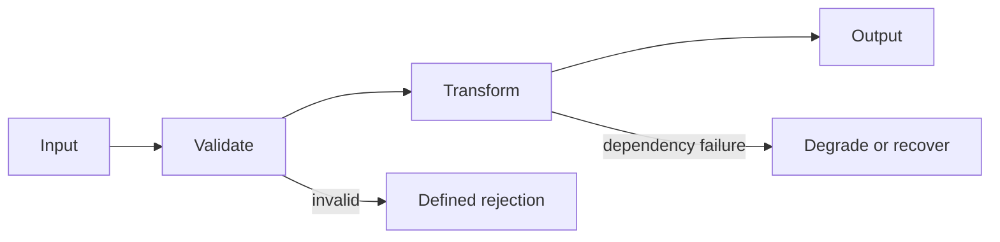

# HLD Testability Guide

Acceptance cases grow from design promises. QA does not need exhaustive UML,
but it needs enough observable behavior to distinguish correct from incorrect.

## Test basis

Identify the authoritative requirement, design, ticket, API/schema, and approved
examples. Record their version or path. Separate:

- confirmed facts
- assumptions proposed for review
- open decisions that block a deterministic oracle
- conflicts between sources

Do not silently choose among conflicting sources.

## 1. System boundary

State what the feature does, does not do, and delegates to callers or
dependencies. Include actors, permissions, and trust boundaries when relevant.

Questions:

- Who can invoke it, and who must not?
- What input enters the boundary, and what output or side effect leaves it?
- Which neighboring system owns validation, retries, storage, or recovery?

## 2. Data flow and state model

Trace input, validation, transformation, persistence, output, and failure paths.
For stateful features, list valid states and transitions. A compact diagram is
often clearer than prose:

## 3. Invariants and constraints

Extract constraints only when supported by the test basis:

- concurrency and ordering
- latency, throughput, capacity, and resource budgets
- consistency and idempotency
- compatibility and migration behavior
- security, privacy, accessibility, and observability
- dependency timeout, degradation, retry, and recovery

Phrase each invariant so a test can observe its success or failure. If a target
is missing, write `NEEDS DECISION`; do not invent a threshold.

## 4. Architecture and dependencies

Identify layering, dependency direction, external services, error propagation,
and compatibility contracts. Architecture claims count as enforced only when a
deterministic check or review owner can verify them.

## Testability exit check

- [ ] Sources and conflicts are identified.
- [ ] In-scope and out-of-scope behavior are explicit.
- [ ] Inputs, outputs, side effects, and state transitions are observable.
- [ ] Important invariants have measurable or decidable outcomes.
- [ ] Failure and recovery behavior is defined where risk requires it.
- [ ] Missing decisions are questions, not fabricated assumptions.

An HLD is a map. ATCs determine whether the destination was reached.
